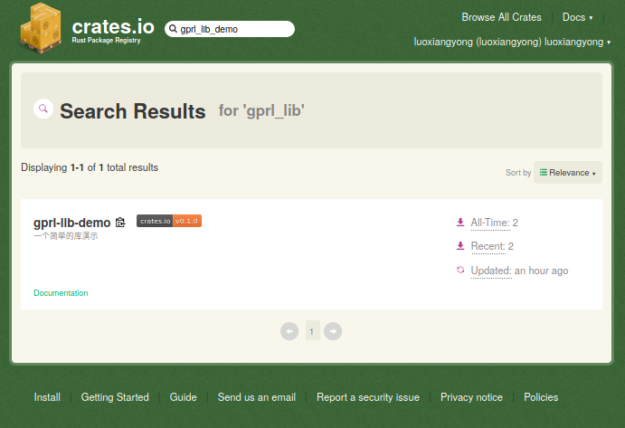

## 使用外部库

好了，有了前节的的基础，我们来学习如何使用外部crate吧。

外部库可以有几种类型：

	1. 发布到https://crates.io上的
	2. 托管带https://github.com上的
	3. 从其他地方拷贝到本地目录的
	4. 其他语言编写的动态库，静态库...

我们在本节使用在第二节完成的`gprl_lib_demo`库作为演示如何使用第三方库。


### 使用发布到https://crates.io上的crate

在第二节中，为了让全世界的人都能使用我们开发的库，我满心欢喜的把她发布到了https://crates.io上，现在你可以在该站点上搜索到这个库了。



下面在chapter01目录下开始我们的工作，项目名字为`use_external_crate`。

```bash
$ cargo new --bin use_external_crate
$ cd use_external_crate
$ vim src/main.rs
```

一行命令建立工程，开始编辑，`rc/main.rs`文件内容如下：

```rust
extern crate gprl_lib_demo;


fn main() {
    println!("本程序演示如何使用外部库");

    let result =  gprl_lib_demo::compute_add(1,1000);

    println!("调用结果为:{}", result);
}
```


工程配置文件`Cargo.toml`内容如下，请根据你的情况做适当修改：

```toml
[package]
name = "use_external_crate"
version = "0.1.0"
authors = ["Luo Xiangyong <luoxiangyong@topgridcloud.com>"]
edition = "2018"

# See more keys and their definitions at https://doc.rust-lang.org/cargo/reference/manifest.html

[dependencies]
gprl-lib-demo = "^0.1.0"
```

运行一下命令：

```bash
$ cargo run
  Downloaded gprl-lib-demo v0.1.2
   Compiling gprl-lib-demo v0.1.2
   Compiling use_external_crate v0.1.0 (/home/luoxiangyong/writing-book/rust-in-practice-code/chapter-02/use_external_crate)
    Finished dev [unoptimized + debuginfo] target(s) in 4.16s
     Running `target/debug/use_external_crate`
本程序演示如何使用外部库
用Rust计算add的结果是:1001
调用结果为:1001
```

可以看到，运行结果显示cargo下载编译并链接了我们的外部库，并且使用了`0.1.2`这个版本。


在`Cargo.toml`文件的依赖项中我们指定`gprl-lib-demo = "^0.1.0"`，这里我们使用了语义化版本($$SemVer$$)写法，意思是告诉cargo，我们要使用gprl-lib-demo的0.1的最新版。关于$$SemVer$$请参考这里：[SemVer 语义化版本规范](https://www.jianshu.com/p/a7490344044f)。


### 使用托管带https://github.com上的crate

还是用我们以前创建的gprl_lib_demo库作为演示，这个库我们已经发布到github上了。有了上面的经验，可以猜测，只用更改依赖方式即可。这里将`Cargo.toml`中gprl-lib-demo依赖项改成如下格式就行了:

```toml
[dependencies]
gprl-lib-demo = {git = "https://github.com/luoxiangyong/gprl_lib_demo.git",branch= "master"}
```

好了，就这么简单，运行一下命令验证下：

```bash
$ cargo run
    Updating git repository `https://github.com/luoxiangyong/gprl_lib_demo.git`
   Compiling gprl-lib-demo v0.1.2 (https://github.com/luoxiangyong/gprl_lib_demo.git#9c537b1e)
   Compiling use_external_crate v0.1.0 (/home/luoxiangyong/writing-book/rust-in-practice-code/chapter-02/use_external_crate)
    Finished dev [unoptimized + debuginfo] target(s) in 3.32s
     Running `target/debug/use_external_crate`
本程序演示如何使用外部库
用Rust计算add的结果是:1001
调用结果为:1001
```

Bingo，搞定！

###  使用从其他地方拷贝到本地目录的crate

假设你已经把别人的外部库已经拷贝到本地的目录了，前创建的gprl_lib_demo库作为演示。目录结构如下：

```bash
$ tree -L 2 ..
..
├── gprl_lib_demo
│   ├── Cargo.toml
│   ├── README.md
│   ├── src
│   ├── target
│   └── tests
├── hello_rust
│   ├── Cargo.lock
│   ├── Cargo.toml
│   ├── src
│   └── target
└── use_external_crate
    ├── Cargo.lock
    ├── Cargo.toml
    ├── config.bak
    ├── src
    └── target

10 directories, 7 files
```

我们想在use_external_crate项目中使用 	项目的crate，可以这么更改use_external_crate的依赖:

```toml
[dependencies]
gprl-lib-demo = { path = "../gprl_lib_demo" }
```

就这么简单，运行一下命令验证下：

```bash
$ cargo run
   Compiling gprl-lib-demo v0.1.2 (/home/luoxiangyong/writing-book/rust-in-practice-code/chapter-02/gprl_lib_demo)
   Compiling use_external_crate v0.1.0 (/home/luoxiangyong/writing-book/rust-in-practice-code/chapter-02/use_external_crate)
    Finished dev [unoptimized + debuginfo] target(s) in 0.90s
     Running `target/debug/use_external_crate`
本程序演示如何使用外部库
用Rust计算add的结果是:1001
调用结果为:1001
```

没问题，运行正常，打完手工！:smile:

### 其他语言编写的动态库，静态库

关于这方面的问题，我们在以后的章节介绍，它设计FFI(Foreign Function Interface）。