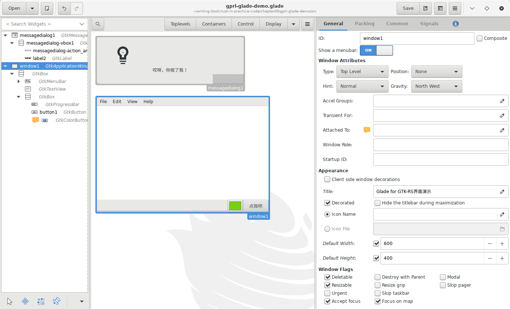
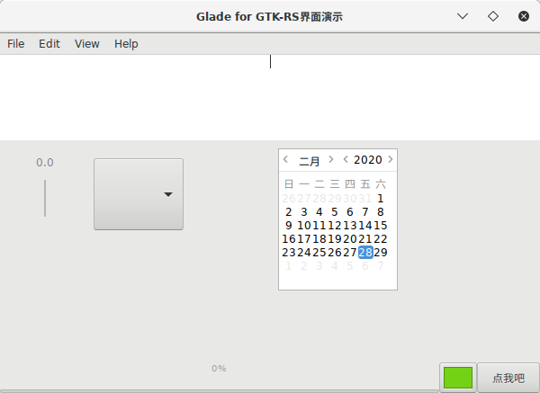

## 使用Glade构建界面

[Glade](https://glade.gnome.org/)是一个让编写GTK程序更简单的工具，可以用它快速建立用户界面，使用和简单，不了解的去官方网站看看。我们来试验下在gtk-rs中如何使用它。

下图是使用中的Glade界面：



其生成的xml代码如下：

```xml
<?xml version="1.0" encoding="UTF-8"?>
<!-- Generated with glade 3.22.1 -->
<interface>
  <requires lib="gtk+" version="3.0"/>
  <object class="GtkMessageDialog" id="messagedialog1">
    <property name="can_focus">False</property>
    <property name="type_hint">dialog</property>
    <child internal-child="vbox">
      <object class="GtkBox" id="messagedialog-vbox1">
        <property name="name">msgdialog</property>
        <property name="width_request">300</property>
        <property name="can_focus">False</property>
        <property name="tooltip_markup" translatable="yes">Thank you for trying this example</property>
        <property name="resize_mode">immediate</property>
        <property name="orientation">vertical</property>
        <property name="spacing">2</property>
        <child internal-child="action_area">
          <object class="GtkButtonBox" id="messagedialog-action_area1">
            <property name="can_focus">False</property>
            <property name="layout_style">end</property>
            <child>
              <placeholder/>
            </child>
          </object>
          <packing>
            <property name="expand">False</property>
            <property name="fill">True</property>
            <property name="pack_type">end</property>
            <property name="position">0</property>
          </packing>
        </child>
        <child>
          <object class="GtkLabel" id="label2">
            <property name="visible">True</property>
            <property name="can_focus">False</property>
            <property name="label" translatable="yes">哎呀，你按了我！</property>
            <property name="ellipsize">end</property>
            <property name="width_chars">40</property>
          </object>
          <packing>
            <property name="expand">False</property>
            <property name="fill">True</property>
            <property name="position">2</property>
          </packing>
        </child>
      </object>
    </child>
  </object>
  <object class="GtkApplicationWindow" id="window1">
    <property name="can_focus">False</property>
    <property name="title" translatable="yes">Glade for GTK-RS界面演示</property>
    <property name="default_width">600</property>
    <property name="default_height">400</property>
    <child>
      <object class="GtkBox">
        <property name="visible">True</property>
        <property name="can_focus">False</property>
        <property name="orientation">vertical</property>
        <child>
          <object class="GtkMenuBar">
            <property name="visible">True</property>
            <property name="can_focus">False</property>
            <child>
              <object class="GtkMenuItem">
                <property name="visible">True</property>
                <property name="can_focus">False</property>
                <property name="label" translatable="yes">_File</property>
                <property name="use_underline">True</property>
                <child type="submenu">
                  <object class="GtkMenu">
                    <property name="visible">True</property>
                    <property name="can_focus">False</property>
                    <child>
                      <object class="GtkImageMenuItem">
                        <property name="label">gtk-new</property>
                        <property name="visible">True</property>
                        <property name="can_focus">False</property>
                        <property name="use_underline">True</property>
                        <property name="use_stock">True</property>
                      </object>
                    </child>
                    <child>
                      <object class="GtkImageMenuItem">
                        <property name="label">gtk-open</property>
                        <property name="visible">True</property>
                        <property name="can_focus">False</property>
                        <property name="use_underline">True</property>
                        <property name="use_stock">True</property>
                      </object>
                    </child>
                    <child>
                      <object class="GtkImageMenuItem">
                        <property name="label">gtk-save</property>
                        <property name="visible">True</property>
                        <property name="can_focus">False</property>
                        <property name="use_underline">True</property>
                        <property name="use_stock">True</property>
                      </object>
                    </child>
                    <child>
                      <object class="GtkImageMenuItem">
                        <property name="label">gtk-save-as</property>
                        <property name="visible">True</property>
                        <property name="can_focus">False</property>
                        <property name="use_underline">True</property>
                        <property name="use_stock">True</property>
                      </object>
                    </child>
                    <child>
                      <object class="GtkSeparatorMenuItem">
                        <property name="visible">True</property>
                        <property name="can_focus">False</property>
                      </object>
                    </child>
                    <child>
                      <object class="GtkImageMenuItem">
                        <property name="label">gtk-quit</property>
                        <property name="visible">True</property>
                        <property name="can_focus">False</property>
                        <property name="use_underline">True</property>
                        <property name="use_stock">True</property>
                      </object>
                    </child>
                  </object>
                </child>
              </object>
            </child>
            <child>
              <object class="GtkMenuItem">
                <property name="visible">True</property>
                <property name="can_focus">False</property>
                <property name="label" translatable="yes">_Edit</property>
                <property name="use_underline">True</property>
                <child type="submenu">
                  <object class="GtkMenu">
                    <property name="visible">True</property>
                    <property name="can_focus">False</property>
                    <child>
                      <object class="GtkImageMenuItem">
                        <property name="label">gtk-cut</property>
                        <property name="visible">True</property>
                        <property name="can_focus">False</property>
                        <property name="use_underline">True</property>
                        <property name="use_stock">True</property>
                      </object>
                    </child>
                    <child>
                      <object class="GtkImageMenuItem">
                        <property name="label">gtk-copy</property>
                        <property name="visible">True</property>
                        <property name="can_focus">False</property>
                        <property name="use_underline">True</property>
                        <property name="use_stock">True</property>
                      </object>
                    </child>
                    <child>
                      <object class="GtkImageMenuItem">
                        <property name="label">gtk-paste</property>
                        <property name="visible">True</property>
                        <property name="can_focus">False</property>
                        <property name="use_underline">True</property>
                        <property name="use_stock">True</property>
                      </object>
                    </child>
                    <child>
                      <object class="GtkImageMenuItem">
                        <property name="label">gtk-delete</property>
                        <property name="visible">True</property>
                        <property name="can_focus">False</property>
                        <property name="use_underline">True</property>
                        <property name="use_stock">True</property>
                      </object>
                    </child>
                  </object>
                </child>
              </object>
            </child>
            <child>
              <object class="GtkMenuItem">
                <property name="visible">True</property>
                <property name="can_focus">False</property>
                <property name="label" translatable="yes">_View</property>
                <property name="use_underline">True</property>
              </object>
            </child>
            <child>
              <object class="GtkMenuItem">
                <property name="visible">True</property>
                <property name="can_focus">False</property>
                <property name="label" translatable="yes">_Help</property>
                <property name="use_underline">True</property>
                <child type="submenu">
                  <object class="GtkMenu">
                    <property name="visible">True</property>
                    <property name="can_focus">False</property>
                    <child>
                      <object class="GtkImageMenuItem">
                        <property name="label">gtk-about</property>
                        <property name="visible">True</property>
                        <property name="can_focus">False</property>
                        <property name="use_underline">True</property>
                        <property name="use_stock">True</property>
                      </object>
                    </child>
                  </object>
                </child>
              </object>
            </child>
          </object>
          <packing>
            <property name="expand">False</property>
            <property name="fill">True</property>
            <property name="position">0</property>
          </packing>
        </child>
        <child>
          <object class="GtkTextView">
            <property name="visible">True</property>
            <property name="can_focus">True</property>
            <property name="wrap_mode">char</property>
            <property name="justification">center</property>
          </object>
          <packing>
            <property name="expand">True</property>
            <property name="fill">True</property>
            <property name="position">1</property>
          </packing>
        </child>
        <child>
          <object class="GtkBox">
            <property name="visible">True</property>
            <property name="can_focus">False</property>
            <child>
              <object class="GtkProgressBar">
                <property name="visible">True</property>
                <property name="can_focus">False</property>
              </object>
              <packing>
                <property name="expand">True</property>
                <property name="fill">True</property>
                <property name="position">0</property>
              </packing>
            </child>
            <child>
              <object class="GtkColorButton">
                <property name="visible">True</property>
                <property name="can_focus">True</property>
                <property name="receives_default">True</property>
                <property name="color">#7373d2d21616</property>
              </object>
              <packing>
                <property name="expand">False</property>
                <property name="fill">True</property>
                <property name="position">1</property>
              </packing>
            </child>
            <child>
              <object class="GtkButton" id="button1">
                <property name="label" translatable="yes">点我吧</property>
                <property name="visible">True</property>
                <property name="can_focus">True</property>
                <property name="receives_default">True</property>
              </object>
              <packing>
                <property name="expand">False</property>
                <property name="fill">True</property>
                <property name="position">2</property>
              </packing>
            </child>
          </object>
          <packing>
            <property name="expand">False</property>
            <property name="fill">True</property>
            <property name="position">2</property>
          </packing>
        </child>
      </object>
    </child>
  </object>
</interface>
```

在这个文件中，我们创建了一个包含一个`Button`的`Window`；还创建了一个`MessageDialog`，其中包含了一个消息文本和一个`Label`。


下面看看如何在gtk-rs中使用他们：

```
// 首先获取文件内容
let glade_src = include_str!("gprl-glade-demo.glade");
// 然后创建Builder
let builder = gtk::Builder::new_from_string(glade_src);

// 开始gtk主循环
gtk::main();
```

简单吧？但是这段代码不会显示任何东西。需要调用`Window`的`show_all`方法。在此之前需要获取窗口:

```rust
let window: gtk::Window = builder.get_object("window1").unwrap();
window.show_all();
```

如果还想做信号绑定，也需要这样做。例如，当点击`Button`时显示`MessageDialog`：

```rust
let button: gtk::Button = builder.get_object("button1").unwrap();
let dialog: gtk::MessageDialog = builder.get_object("messagedialog1").unwrap();

button.connect_clicked(move |_| {
    // 阻塞运行
    dialog.run();
    // 完成后，隐藏！
    dialog.hide();
});
```

完整代码如下：

```rust
extern crate gio;
extern crate gtk;

use gio::prelude::*;
use gtk::prelude::*;

use gtk::{ApplicationWindow, Builder, Button, MessageDialog};

use std::env::args;

fn build_ui(application: &gtk::Application) {
    let glade_src = include_str!("gprl-glade-demo.glade");
    let builder = Builder::new_from_string(glade_src);

    let window: ApplicationWindow = builder.get_object("window1").expect("Couldn't get window1");
    window.set_application(Some(application));
    let bigbutton: Button = builder.get_object("button1").expect("Couldn't get button1");
    let dialog: MessageDialog = builder
        .get_object("messagedialog1")
        .expect("Couldn't get messagedialog1");

    bigbutton.connect_clicked(move |_| {
        dialog.run();
        dialog.hide();
    });

    window.show_all();
}

fn main() {
    let application = gtk::Application::new(
        Some("com.github.gtk-rs.examples.builder_basics"),
        Default::default(),
    )
    .expect("Initialization failed...");

    application.connect_activate(|app| {
        build_ui(app);
    });

    application.run(&args().collect::<Vec<_>>());
}
```

编译运行后，界面显示如下：



## 