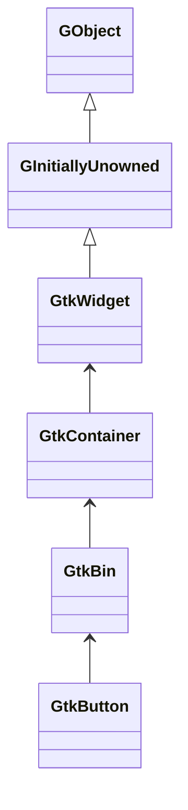
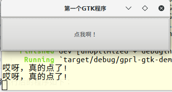

# GTK


[GTK](https://www.gtk.org/)

## GTK-RS介绍

目前在Rust使用gtk主要依赖gtk-rs，她是gtk的Rust语言绑定，官方网址为：https://gtk-rs.org 。目前gtk-rs官方提供如下几个库：

| 序号 |    库名    |               用途               |
| :--: | :--------: | :------------------------------: |
|  1   |    Gtk     |        各种窗口widget组件        |
|  2   |    Gdk     | 底层系统提供的窗口与图形系统功能 |
|  3   | Gdk-pixbuf |          图像加载与操作          |
|  4   |   Cairo    |           矢量图形API            |
|  5   |    Glib    |       数据结构与辅助功能库       |
|  6   |    Gio     |           文件系统抽象           |
|  7   |   Pango    |     布局引擎、文本及字体处理     |

在使用gtk-rs前需要知道，所有对象都是可以clone的，这并不带来损失，跟拷贝指针一样高效，理解这点很重要。原因很简单，因为gtk-rs的结构包含了一个gnome的对象指针。拷贝是安全的，但有一点需要注意，它不是线程安全的，不能在另外的线程中调用gnome的函数。当一个结构被drop后，会调用内部的`g_object_unref`函数，而在`clone`的时候会调用`g_object_ref`。为了编程简单化，gnome在内部帮我们处理资源的申请和释放。

### GTK 类的层次结构

```mermaid
classDiagram
	GObject <|-- GInitiallyUnowned
	
	GInitiallyUnowned <|-- GtkWidget
	GtkWidget <-- GtkContainer
	GtkWidget <-- GtkMisc
	GtkWidget <-- GtkCalendar
	GtkWidget <-- GtkCellView
	GtkWidget <-- GtkDrawArea
	GtkWidget <-- GtkEntry
	GtkWidget <-- GtkGlArea
	GtkWidget <-- GtkRange
	GtkWidget <-- GtkSeperator
	GtkWidget <-- GtkHsv
	GtkWidget <-- GtkInvisible
	GtkWidget <-- GtkProgressBar
	GtkWidget <-- GtkSinner
	GtkWidget <-- GtkSwitch
	GtkWidget <-- GtkLevelBar
	
	GtkContainer <|-- GtkBin
	GtkContainer <|-- GtkBox
	GtkContainer <|-- GtkFixed
	GtkContainer <|-- GtkFlow
	GtkContainer <|-- GtkGrid
	GtkContainer <|-- GtkHeaderBar
	GtkContainer <|-- GtkPaned
	GtkContainer <|-- GtkIconView
	GtkContainer <|-- GtkLayout
	GtkContainer <|-- GtkListBox
	GtkContainer <|-- GtkMenuShell
	GtkContainer <|-- GtkNotebook
	GtkContainer <|-- GtkSocket
	GtkContainer <|-- GtkStack
	GtkContainer <|-- GtkTable
	GtkContainer <|-- GtkTextView
	GtkContainer <|-- GtkToolbar
	GtkContainer <|-- GtkToolItemGroup
	GtkContainer <|-- GtkToolPallete
	GtkContainer <|-- GtkTreeView
	
	GtkBin <|-- GtkWindow
	GtkWindow <|-- GtkDialog
	GtkWindow <|-- GtkApplicatonWindow
	GtkWindow <|-- GtkAssistant
	GtkWindow <|-- GtkOffscreenWindow
	GtkWindow <|-- GtkPlug
	GtkWindow <|-- GtkShotcutsWindow
	
	GtkDialog <|-- GtkAboutDialog
	GtkDialog <|-- GtkAppChooserDialog
	GtkDialog <|-- GtkColorChooserDialog
	GtkDialog <|-- GtkColorSelectDialog
	GtkDialog <|-- GtkFileChooserDialog
	GtkDialog <|-- GtkFontChooserDialog
	GtkDialog <|-- GtkFontSelectionDialog
	GtkDialog <|-- GtkMessageDialog
	GtkDialog <|-- GtkPageSetupUnixDialog
	GtkDialog <|-- GtkPrintUnixDialog
	GtkDialog <|-- GtkRecentChooserDialog
	
	GtkBin <|-- GtkAction
	GtkBin <|-- GtkAlignment
	GtkBin <|-- GtkComboBox
	GtkBin <|-- GtkFrame
	GtkBin <|-- GtkBotton
	GtkBin <|-- GtkMemuItem
	GtkBin <|-- GtkEventBox
	GtkBin <|-- GtkExpander
	GtkBin <|-- GtkFlowBoxChild
	GtkBin <|-- GtkHandleBox
	GtkBin <|-- GtkListBoxRow
	GtkBin <|-- GtkToolItem
	GtkBin <|-- GtkOverlay
	GtkBin <|-- GtkScrolledWindow
	GtkBin <|-- GtkPopover
	GtkBin <|-- GtkRevealer
	GtkBin <|-- GtkSearchBar
	GtkBin <|-- GtkStackSideBar
	GtkBin <|-- GtkViewport
	
```



### Gtk-rs trait的层次结构

跟gtk的类层级结构基本是一一对应的。



这意味着`Button`可以使用父类的所有方法。因此，如果你想使用父类的方法，导入它就可以了，例如：

```rust
// 导入Widget的方法
use gtk::WidgetExt;

// 创建一个Botton
let button = gtk::Button::new_with_label("Click me!");

// 使用widget中的方法
button.show_all();
```

就是这么简单。So easy!:smile:

**接口(interface)**

接口的使用也一样。 [gnome文档](https://developer.gnome.org/gtk3/stable/GtkButton.html)中说`Button`实现了`GtkBuildable`, `GtkActionable` 和 `GtkActivatable`，像使用父类的方法一样，导入相关的接口就可以了。


### 关于版本

默认情况下，gtk-rs只提供gtk 3.4版的对象和函数。如果你想使用新的版本，需要通过cargo的`featers`来指定。不熟悉cargo 特性的同学，请到[choose-features](http://doc.crates.io/specifying-dependencies.html#choosing-features)。学习！

我们来看看gtk-rs提供的特性列表：

```toml
v3_6 = ["gtk-sys/v3_6", "gdk/v3_6"]
v3_8 = ["v3_6", "gtk-sys/v3_8", "gdk/v3_8"]
v3_10 = ["v3_8", "gtk-sys/v3_10", "gdk/v3_10"]
v3_12 = ["v3_10", "gtk-sys/v3_12", "gdk/v3_12"]
v3_14 = ["v3_12", "gtk-sys/v3_14", "gdk/v3_14"]
v3_16 = ["v3_14", "gtk-sys/v3_16", "gdk/v3_16"]
v3_18 = ["v3_16", "gtk-sys/v3_18", "gdk/v3_18"]
v3_20 = ["v3_18", "gtk-sys/v3_20", "gdk/v3_20"]
v3_22 = ["v3_20", "gtk-sys/v3_22", "gdk/v3_22"]
```

请注意，每个版本特性都包含了前一个版本的特性，也就是说如果你使用了`v3_22`的版本特性，那也可以使用`v3_20`及以前的所有特性。

通过一下命令可以查看你系统安装的gtk版本：

```bash
$ pkg-config --list-all | grep gtk
```

有一点需要注意，如果你系统上安装的是gtk 3.8版本的，那你就不能使用高于此版本`v3_8`的特性，否则编译不过的！

在`Cargo.toml`中，我们可以指定使用哪一个版本，像这样：

```toml
[dependencies.gtk]
version = "0.1"
default-features = false  # just in case
features = ["v3_18"]
```

如果你想提供多版本的crate，可以添加多个feature：

```toml
[features]
gtk_3_10 = ["gtk/v3_10"]
gtk_3_14 = ["gtk/v3_14"]
```

上面代码的意思是，我的crate提供了两个特性：`gtk_3_10`和`gtk_3_14`，分别依赖`gtk/v3_10`和`gtk/v3_14`。当其他人想使用我们的crate时，她安装了新版本的gtk，则可以像下面这样创建我的crate：

```bash
$ cargo build --features gtk_3_14
```


## 第一个GTK程序


```toml
[package]
name = "gprl-gtk-demo"
version = "0.1.0"
authors = ["Luo Xiangyong <luoxiangyong@topgridcloud.com>"]
edition = "2018"

[dependencies.gtk]
version = "0.8.0"
#features = ["v3_16"]

[dependencies.gio]
version = ""
#features = ["v2_44"]
```

```rust
extern crate gtk;
extern crate gio;

use gtk::prelude::*;
use gio::prelude::*;

use gtk::{Application, ApplicationWindow, Button};

fn main() {
    let application = Application::new(
        Some("com.github.luoxiangyong.examples.gtk.demo"),
        Default::default(),
    ).expect("failed to initialize GTK application");

    application.connect_activate(|app| {
        let window = ApplicationWindow::new(app);
        window.set_title("第一个GTK程序");
        window.set_default_size(350, 70);

        let button = Button::new_with_label("点我啊！");
        button.connect_clicked(|_| {
            println!("哎呀，真的点了!");
        });
        window.add(&button);

        window.show_all();
    });

    application.run(&[]);
}
```

编译运行后的程序如下：



### 闭包和回调

在GUI编程中，当有个时间发生时，回调一个函数是很常见的，下面看看在gtk-rs如何做。

闭包可以捕获调用她时的环境，这点与函数指针不同，这个特性很有用，我们不在需要传递参数了。但是闭包的生命周期很难跟踪。在gtk-rs中，我们确保闭包的生命周期是`static`的，这样的话捕获的对象在闭包被调用是依然是存活的。我们看个例子吧。

在C语言中，我们一般这么写：

```c
#include <gtk/gtk.h>

void callback_clicked(GtkWidget *widget, gpointer data) {
    gtk_button_set_label(GTK_BUTTON(widget), "Window");
}
```

