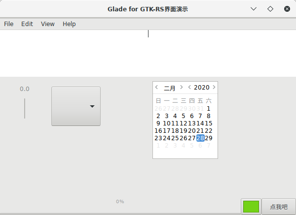

# GTK


[GTK](https://www.gtk.org/)

## GTK-RS介绍

目前在Rust使用gtk主要依赖gtk-rs，她是gtk的Rust语言绑定，官方网址为：https://gtk-rs.org 。目前gtk-rs官方提供如下几个库：

| 序号 |    库名    |               用途               |
| :--: | :--------: | :------------------------------: |
|  1   |    Gtk     |        各种窗口widget组件        |
|  2   |    Gdk     | 底层系统提供的窗口与图形系统功能 |
|  3   | Gdk-pixbuf |          图像加载与操作          |
|  4   |   Cairo    |           矢量图形API            |
|  5   |    Glib    |       数据结构与辅助功能库       |
|  6   |    Gio     |           文件系统抽象           |
|  7   |   Pango    |     布局引擎、文本及字体处理     |

在使用gtk-rs前需要知道，所有对象都是可以clone的，这并不带来损失，跟拷贝指针一样高效，理解这点很重要。原因很简单，因为gtk-rs的结构包含了一个gnome的对象指针。拷贝是安全的，但有一点需要注意，它不是线程安全的，不能在另外的线程中调用gnome的函数。当一个结构被drop后，会调用内部的`g_object_unref`函数，而在`clone`的时候会调用`g_object_ref`。为了编程简单化，gnome在内部帮我们处理资源的申请和释放。

### GTK 类的层次结构

```mermaid
classDiagram
	GObject <|-- GInitiallyUnowned
	
	GInitiallyUnowned <|-- GtkWidget
	GtkWidget <-- GtkContainer
	GtkWidget <-- GtkMisc
	GtkWidget <-- GtkCalendar
	GtkWidget <-- GtkCellView
	GtkWidget <-- GtkDrawArea
	GtkWidget <-- GtkEntry
	GtkWidget <-- GtkGlArea
	GtkWidget <-- GtkRange
	GtkWidget <-- GtkSeperator
	GtkWidget <-- GtkHsv
	GtkWidget <-- GtkInvisible
	GtkWidget <-- GtkProgressBar
	GtkWidget <-- GtkSinner
	GtkWidget <-- GtkSwitch
	GtkWidget <-- GtkLevelBar
	
	GtkContainer <|-- GtkBin
	GtkContainer <|-- GtkBox
	GtkContainer <|-- GtkFixed
	GtkContainer <|-- GtkFlow
	GtkContainer <|-- GtkGrid
	GtkContainer <|-- GtkHeaderBar
	GtkContainer <|-- GtkPaned
	GtkContainer <|-- GtkIconView
	GtkContainer <|-- GtkLayout
	GtkContainer <|-- GtkListBox
	GtkContainer <|-- GtkMenuShell
	GtkContainer <|-- GtkNotebook
	GtkContainer <|-- GtkSocket
	GtkContainer <|-- GtkStack
	GtkContainer <|-- GtkTable
	GtkContainer <|-- GtkTextView
	GtkContainer <|-- GtkToolbar
	GtkContainer <|-- GtkToolItemGroup
	GtkContainer <|-- GtkToolPallete
	GtkContainer <|-- GtkTreeView
	
	GtkBin <|-- GtkWindow
	GtkWindow <|-- GtkDialog
	GtkWindow <|-- GtkApplicatonWindow
	GtkWindow <|-- GtkAssistant
	GtkWindow <|-- GtkOffscreenWindow
	GtkWindow <|-- GtkPlug
	GtkWindow <|-- GtkShotcutsWindow
	
	GtkDialog <|-- GtkAboutDialog
	GtkDialog <|-- GtkAppChooserDialog
	GtkDialog <|-- GtkColorChooserDialog
	GtkDialog <|-- GtkColorSelectDialog
	GtkDialog <|-- GtkFileChooserDialog
	GtkDialog <|-- GtkFontChooserDialog
	GtkDialog <|-- GtkFontSelectionDialog
	GtkDialog <|-- GtkMessageDialog
	GtkDialog <|-- GtkPageSetupUnixDialog
	GtkDialog <|-- GtkPrintUnixDialog
	GtkDialog <|-- GtkRecentChooserDialog
	
	GtkBin <|-- GtkAction
	GtkBin <|-- GtkAlignment
	GtkBin <|-- GtkComboBox
	GtkBin <|-- GtkFrame
	GtkBin <|-- GtkBotton
	GtkBin <|-- GtkMemuItem
	GtkBin <|-- GtkEventBox
	GtkBin <|-- GtkExpander
	GtkBin <|-- GtkFlowBoxChild
	GtkBin <|-- GtkHandleBox
	GtkBin <|-- GtkListBoxRow
	GtkBin <|-- GtkToolItem
	GtkBin <|-- GtkOverlay
	GtkBin <|-- GtkScrolledWindow
	GtkBin <|-- GtkPopover
	GtkBin <|-- GtkRevealer
	GtkBin <|-- GtkSearchBar
	GtkBin <|-- GtkStackSideBar
	GtkBin <|-- GtkViewport
	
```



### Gtk-rs trait的层次结构

跟gtk的类层级结构基本是一一对应的。


这意味着`Button`可以使用父类的所有方法。因此，如果你想使用父类的方法，导入它就可以了，例如：

```rust
// 导入Widget的方法
use gtk::WidgetExt;

// 创建一个Botton
let button = gtk::Button::new_with_label("Click me!");

// 使用widget中的方法
button.show_all();
```

就是这么简单。So easy!:smile:

**接口(interface)**

接口的使用也一样。 [gnome文档](https://developer.gnome.org/gtk3/stable/GtkButton.html)中说`Button`实现了`GtkBuildable`, `GtkActionable` 和 `GtkActivatable`，像使用父类的方法一样，导入相关的接口就可以了。


### 关于版本

默认情况下，gtk-rs只提供gtk 3.4版的对象和函数。如果你想使用新的版本，需要通过cargo的`featers`来指定。不熟悉cargo 特性的同学，请到[choose-features](http://doc.crates.io/specifying-dependencies.html#choosing-features)。学习！

我们来看看gtk-rs提供的特性列表：

```toml
v3_6 = ["gtk-sys/v3_6", "gdk/v3_6"]
v3_8 = ["v3_6", "gtk-sys/v3_8", "gdk/v3_8"]
v3_10 = ["v3_8", "gtk-sys/v3_10", "gdk/v3_10"]
v3_12 = ["v3_10", "gtk-sys/v3_12", "gdk/v3_12"]
v3_14 = ["v3_12", "gtk-sys/v3_14", "gdk/v3_14"]
v3_16 = ["v3_14", "gtk-sys/v3_16", "gdk/v3_16"]
v3_18 = ["v3_16", "gtk-sys/v3_18", "gdk/v3_18"]
v3_20 = ["v3_18", "gtk-sys/v3_20", "gdk/v3_20"]
v3_22 = ["v3_20", "gtk-sys/v3_22", "gdk/v3_22"]
```

请注意，每个版本特性都包含了前一个版本的特性，也就是说如果你使用了`v3_22`的版本特性，那也可以使用`v3_20`及以前的所有特性。

通过一下命令可以查看你系统安装的gtk版本：

```bash
$ pkg-config --list-all | grep gtk
```

有一点需要注意，如果你系统上安装的是gtk 3.8版本的，那你就不能使用高于此版本`v3_8`的特性，否则编译不过的！

在`Cargo.toml`中，我们可以指定使用哪一个版本，像这样：

```toml
[dependencies.gtk]
version = "0.1"
default-features = false  # just in case
features = ["v3_18"]
```

如果你想提供多版本的crate，可以添加多个feature：

```toml
[features]
gtk_3_10 = ["gtk/v3_10"]
gtk_3_14 = ["gtk/v3_14"]
```

上面代码的意思是，我的crate提供了两个特性：`gtk_3_10`和`gtk_3_14`，分别依赖`gtk/v3_10`和`gtk/v3_14`。当其他人想使用我们的crate时，她安装了新版本的gtk，则可以像下面这样创建我的crate：

```bash
$ cargo build --features gtk_3_14
```


## 第一个GTK程序


```toml
[package]
name = "gprl-gtk-demo"
version = "0.1.0"
authors = ["Luo Xiangyong <luoxiangyong@topgridcloud.com>"]
edition = "2018"

[dependencies.gtk]
version = "0.8.0"
#features = ["v3_16"]

[dependencies.gio]
version = ""
#features = ["v2_44"]
```

```rust
extern crate gtk;
extern crate gio;

use gtk::prelude::*;
use gio::prelude::*;

use gtk::{Application, ApplicationWindow, Button};

fn main() {
    let application = Application::new(
        Some("com.github.luoxiangyong.examples.gtk.demo"),
        Default::default(),
    ).expect("failed to initialize GTK application");

    application.connect_activate(|app| {
        let window = ApplicationWindow::new(app);
        window.set_title("第一个GTK程序");
        window.set_default_size(350, 70);

        let button = Button::new_with_label("点我啊！");
        button.connect_clicked(|_| {
            println!("哎呀，真的点了!");
        });
        window.add(&button);

        window.show_all();
    });

    application.run(&[]);
}
```

编译运行后的程序如下：


### 闭包和回调

在GUI编程中，当有个时间发生时，回调一个函数是很常见的，下面看看在gtk-rs如何做。

闭包可以捕获调用她时的环境，这点与函数指针不同，这个特性很有用，我们不在需要传递参数了。但是闭包的生命周期很难跟踪。在gtk-rs中，我们确保闭包的生命周期是`static`的，这样的话捕获的对象在闭包被调用是依然是存活的。我们看个例子吧。

在C语言中，我们一般这么写：

```c
#include <gtk/gtk.h>

void callback_clicked(GtkWidget *widget, gpointer data) {
    gtk_button_set_label(GTK_BUTTON(widget), "Window");
}
```

而在Rust中，我们这么写：

```rust
use gtk::{Button, ButtonExt};

let button = Button::new_with_label("Click me!");
button.connect_clicked(|but| {
    but.set_label("I've been clicked!");
});
```

很简单不是吗？如果在按钮被点击的情况下更新另外的窗口呢？比如下面这样：

```rust
use gtk::{Box, Button, ButtonExt, ContainerExt, WidgetExt};

// 先创建一个布局 layout
let container = Box::new(gtk::Orientation::Vertical, 5);
// label的文字将在闭包中被修改
let label = gtk::Label::new("");
let button = Button::new_with_label("Click me!");
button.connect_clicked(move |_| {
    label.set_label("Button has been clicked!");
});

container.add(&button);
container.add(&label);

```

很不辛，编译这段代码，会出现如下错误：

```bash
error[E0382]: use of moved value: `label`
```

它是说`label`的所有权被转移到闭包后，又被12行的代码使用了！为了让这段代码正常工作，我们只需要在将`label`转移（`move`）到闭包前`clone`它就可以了：

```rust
use gtk::{Box, Button, ButtonExt, ContainerExt, WidgetExt};

let container = Box::new(gtk::Orientation::Vertical, 5);

let label = gtk::Label::new("");
let button = Button::new_with_label("Click me!");

let label_clone = label.clone(); // <-- 这里clone一下下啦！
button.connect_clicked(move |_| {
    label_clone.set_label("Button has been clicked!");
});
```

现在再编译就没问题了。记住，`clone`只是带来了拷贝指针的代价，这不是问题。

**在闭包中时候非gtk-rs对象**

举个栗子，假如你正在写一个多窗口的应用程序，想在程序中跟踪窗口，以便在多个闭包中访问他们，该如何做呢？

一种方法是使用标准库中的`Rc`和`RefCell`。我们看看怎么做：

```rust
use gtk::{Button, ButtonExt, Window};

use std::cell::RefCell;
use std::collections::HashMap;
use std::rc::Rc;

let windows: Rc<RefCell<HashMap<usize, Window>>> = Rc::new(RefCell::new(HashMap::new()));
let button = Button::new_with_label("Click me!");
// We copy the reference to the cell containing the hashmap.
let windows_clone = windows.clone();
button.connect_clicked(move |_| {
    // create_window functions creates a window and return the following tuple: (usize, Window).
    let (window_id, window) = create_window();
    windows_clone.borrow_mut().unwrap().insert(window_id, window);
});

 ...

another_button.connect_clicked(move |_| {
    let id_to_remove = get_id_to_remove();
    windows.borrow_mut().unwrap().remove(&id_to_remove);
});
```

下面解释下`Rc<RefCell<T>>`是如何工作的：

+ `Rc`就是一个引用计数器，它记录了包含的对象示例被引用的次数，当计数为零时释放该对象。

+ `RefCell`复杂一点，它可以让一个不可变(unmutable)对象变得可变(mutable)。

下面这个宏可以让生活轻松点，不过理解这段代码可能不太轻松，需要你理解Rust的语法：

```rust
macro_rules! clone {
    (@param _) => ( _ );
    (@param $x:ident) => ( $x );
    ($($n:ident),+ => move || $body:expr) => (
        {
            $( let $n = $n.clone(); )+
            move || $body
        }
    );
    ($($n:ident),+ => move |$($p:tt),+| $body:expr) => (
        {
            $( let $n = $n.clone(); )+
            move |$(clone!(@param $p),)+| $body
        }
    );
}
```

这段代码意思就是帮你在闭包前调用一要转移到闭包中变量的`clone`一下，因此，上面的代码就可以这样写了：

```rust
let windows: Rc<RefCell<HashMap<usize, Window>>> = Rc::new(RefCell::new(HashMap::new()));
button.connect_clicked(clone!(windows => move |_| {
    let (window_id, window) = create_window();
    windows.borrow_mut().unwrap().insert(window_id, window);
}));
```

### 向上或向下转型(Upcast and downcast)

因为GTK有一套继承体系，很自然gtk-rs中也有。一般情况下，多数人不需要了解这些，不过了解一下它是怎么工作的也未尝不可。

向上转型比较简单：

```rust
let button = gtk::Button::new_with_label("Click me!");
let widget = button.upcast::<gtk::Widget>();
```

因为`Button`结构实现了`IsA<Widget>`，我们可以将它向上转型为`Widget`。每个`Widget`及其父类都实现了`IsA`trait，都可以做类似的向上转型。

如果你想写一个通用函数用来检查某个`Widget`是不是`Box`，代码像这样：

```rust
fn is_a_box<W: IsA<gtk::Object> + IsA<gtk::Widget> + Clone>(widget: &W) -> bool {
    widget.clone().upcast::<gtk::Widget>().is::<gtk::Box>()
}
```

这段代码什么意思呢？首先，注意到我们使用了`IsA`trait。参数`widget`需要实现`IsA<Widget>` 和 `IsA<Object>`。其次，我们需要`Object`能够使用`Cast`trait（包含`upcast`和`downcast`方法）。

其实，我们并不需要参数`widget`一定要是`Widget`类型的，这里这么写是为了简单，容易理解。

上面这个函数的关键点是将`widget`向上转型到更高类型的Widget，然后向下转型到需要的对象类型。我们可以先让这个函数更通用，像这样：

```rust
fn is_a<W: IsA<gtk::Object> + IsA<gtk::Widget> + Clone,
        T: IsA<gtk::Object> + IsA<gtk::Widget>>(widget: &W) -> bool {
    widget.clone().upcast::<gtk::Widget>().downcast::<T>().is_ok()
}
```

然后这样使用它：

```rust
let button = gtk::Button::new_with_label("Click me!");

assert_eq!(is_a::<_, gtk::Container>(&button), true);
assert_eq!(is_a::<_, gtk::Label>(&button), false);
```

有了以上的解释，理解第一程序是不是就简单了？好了我们说说后面的主题。

## Glade

[Glade](https://glade.gnome.org/)是一个让编写GTK程序更简单的工具，可以用它快速建立用户界面，使用和简单，不了解的去官方网站看看。我们来试验下在gtk-rs中如何使用它。

下图是使用中的Glade界面：


其生成的xml代码如下：

```xml
<?xml version="1.0" encoding="UTF-8"?>
<!-- Generated with glade 3.22.1 -->
<interface>
  <requires lib="gtk+" version="3.0"/>
  <object class="GtkMessageDialog" id="messagedialog1">
    <property name="can_focus">False</property>
    <property name="type_hint">dialog</property>
    <child internal-child="vbox">
      <object class="GtkBox" id="messagedialog-vbox1">
        <property name="name">msgdialog</property>
        <property name="width_request">300</property>
        <property name="can_focus">False</property>
        <property name="tooltip_markup" translatable="yes">Thank you for trying this example</property>
        <property name="resize_mode">immediate</property>
        <property name="orientation">vertical</property>
        <property name="spacing">2</property>
        <child internal-child="action_area">
          <object class="GtkButtonBox" id="messagedialog-action_area1">
            <property name="can_focus">False</property>
            <property name="layout_style">end</property>
            <child>
              <placeholder/>
            </child>
          </object>
          <packing>
            <property name="expand">False</property>
            <property name="fill">True</property>
            <property name="pack_type">end</property>
            <property name="position">0</property>
          </packing>
        </child>
        <child>
          <object class="GtkLabel" id="label2">
            <property name="visible">True</property>
            <property name="can_focus">False</property>
            <property name="label" translatable="yes">哎呀，你按了我！</property>
            <property name="ellipsize">end</property>
            <property name="width_chars">40</property>
          </object>
          <packing>
            <property name="expand">False</property>
            <property name="fill">True</property>
            <property name="position">2</property>
          </packing>
        </child>
      </object>
    </child>
  </object>
  <object class="GtkApplicationWindow" id="window1">
    <property name="can_focus">False</property>
    <property name="title" translatable="yes">Glade for GTK-RS界面演示</property>
    <property name="default_width">600</property>
    <property name="default_height">400</property>
    <child>
      <object class="GtkBox">
        <property name="visible">True</property>
        <property name="can_focus">False</property>
        <property name="orientation">vertical</property>
        <child>
          <object class="GtkMenuBar">
            <property name="visible">True</property>
            <property name="can_focus">False</property>
            <child>
              <object class="GtkMenuItem">
                <property name="visible">True</property>
                <property name="can_focus">False</property>
                <property name="label" translatable="yes">_File</property>
                <property name="use_underline">True</property>
                <child type="submenu">
                  <object class="GtkMenu">
                    <property name="visible">True</property>
                    <property name="can_focus">False</property>
                    <child>
                      <object class="GtkImageMenuItem">
                        <property name="label">gtk-new</property>
                        <property name="visible">True</property>
                        <property name="can_focus">False</property>
                        <property name="use_underline">True</property>
                        <property name="use_stock">True</property>
                      </object>
                    </child>
                    <child>
                      <object class="GtkImageMenuItem">
                        <property name="label">gtk-open</property>
                        <property name="visible">True</property>
                        <property name="can_focus">False</property>
                        <property name="use_underline">True</property>
                        <property name="use_stock">True</property>
                      </object>
                    </child>
                    <child>
                      <object class="GtkImageMenuItem">
                        <property name="label">gtk-save</property>
                        <property name="visible">True</property>
                        <property name="can_focus">False</property>
                        <property name="use_underline">True</property>
                        <property name="use_stock">True</property>
                      </object>
                    </child>
                    <child>
                      <object class="GtkImageMenuItem">
                        <property name="label">gtk-save-as</property>
                        <property name="visible">True</property>
                        <property name="can_focus">False</property>
                        <property name="use_underline">True</property>
                        <property name="use_stock">True</property>
                      </object>
                    </child>
                    <child>
                      <object class="GtkSeparatorMenuItem">
                        <property name="visible">True</property>
                        <property name="can_focus">False</property>
                      </object>
                    </child>
                    <child>
                      <object class="GtkImageMenuItem">
                        <property name="label">gtk-quit</property>
                        <property name="visible">True</property>
                        <property name="can_focus">False</property>
                        <property name="use_underline">True</property>
                        <property name="use_stock">True</property>
                      </object>
                    </child>
                  </object>
                </child>
              </object>
            </child>
            <child>
              <object class="GtkMenuItem">
                <property name="visible">True</property>
                <property name="can_focus">False</property>
                <property name="label" translatable="yes">_Edit</property>
                <property name="use_underline">True</property>
                <child type="submenu">
                  <object class="GtkMenu">
                    <property name="visible">True</property>
                    <property name="can_focus">False</property>
                    <child>
                      <object class="GtkImageMenuItem">
                        <property name="label">gtk-cut</property>
                        <property name="visible">True</property>
                        <property name="can_focus">False</property>
                        <property name="use_underline">True</property>
                        <property name="use_stock">True</property>
                      </object>
                    </child>
                    <child>
                      <object class="GtkImageMenuItem">
                        <property name="label">gtk-copy</property>
                        <property name="visible">True</property>
                        <property name="can_focus">False</property>
                        <property name="use_underline">True</property>
                        <property name="use_stock">True</property>
                      </object>
                    </child>
                    <child>
                      <object class="GtkImageMenuItem">
                        <property name="label">gtk-paste</property>
                        <property name="visible">True</property>
                        <property name="can_focus">False</property>
                        <property name="use_underline">True</property>
                        <property name="use_stock">True</property>
                      </object>
                    </child>
                    <child>
                      <object class="GtkImageMenuItem">
                        <property name="label">gtk-delete</property>
                        <property name="visible">True</property>
                        <property name="can_focus">False</property>
                        <property name="use_underline">True</property>
                        <property name="use_stock">True</property>
                      </object>
                    </child>
                  </object>
                </child>
              </object>
            </child>
            <child>
              <object class="GtkMenuItem">
                <property name="visible">True</property>
                <property name="can_focus">False</property>
                <property name="label" translatable="yes">_View</property>
                <property name="use_underline">True</property>
              </object>
            </child>
            <child>
              <object class="GtkMenuItem">
                <property name="visible">True</property>
                <property name="can_focus">False</property>
                <property name="label" translatable="yes">_Help</property>
                <property name="use_underline">True</property>
                <child type="submenu">
                  <object class="GtkMenu">
                    <property name="visible">True</property>
                    <property name="can_focus">False</property>
                    <child>
                      <object class="GtkImageMenuItem">
                        <property name="label">gtk-about</property>
                        <property name="visible">True</property>
                        <property name="can_focus">False</property>
                        <property name="use_underline">True</property>
                        <property name="use_stock">True</property>
                      </object>
                    </child>
                  </object>
                </child>
              </object>
            </child>
          </object>
          <packing>
            <property name="expand">False</property>
            <property name="fill">True</property>
            <property name="position">0</property>
          </packing>
        </child>
        <child>
          <object class="GtkTextView">
            <property name="visible">True</property>
            <property name="can_focus">True</property>
            <property name="wrap_mode">char</property>
            <property name="justification">center</property>
          </object>
          <packing>
            <property name="expand">True</property>
            <property name="fill">True</property>
            <property name="position">1</property>
          </packing>
        </child>
        <child>
          <object class="GtkBox">
            <property name="visible">True</property>
            <property name="can_focus">False</property>
            <child>
              <object class="GtkProgressBar">
                <property name="visible">True</property>
                <property name="can_focus">False</property>
              </object>
              <packing>
                <property name="expand">True</property>
                <property name="fill">True</property>
                <property name="position">0</property>
              </packing>
            </child>
            <child>
              <object class="GtkColorButton">
                <property name="visible">True</property>
                <property name="can_focus">True</property>
                <property name="receives_default">True</property>
                <property name="color">#7373d2d21616</property>
              </object>
              <packing>
                <property name="expand">False</property>
                <property name="fill">True</property>
                <property name="position">1</property>
              </packing>
            </child>
            <child>
              <object class="GtkButton" id="button1">
                <property name="label" translatable="yes">点我吧</property>
                <property name="visible">True</property>
                <property name="can_focus">True</property>
                <property name="receives_default">True</property>
              </object>
              <packing>
                <property name="expand">False</property>
                <property name="fill">True</property>
                <property name="position">2</property>
              </packing>
            </child>
          </object>
          <packing>
            <property name="expand">False</property>
            <property name="fill">True</property>
            <property name="position">2</property>
          </packing>
        </child>
      </object>
    </child>
  </object>
</interface>
```

在这个文件中，我们创建了一个包含一个`Button`的`Window`；还创建了一个`MessageDialog`，其中包含了一个消息文本和一个`Label`。


下面看看如何在gtk-rs中使用他们：

```
// 首先获取文件内容
let glade_src = include_str!("gprl-glade-demo.glade");
// 然后创建Builder
let builder = gtk::Builder::new_from_string(glade_src);

// 开始gtk主循环
gtk::main();
```

简单吧？但是这段代码不会显示任何东西。需要调用`Window`的`show_all`方法。在此之前需要获取窗口:

```rust
let window: gtk::Window = builder.get_object("window1").unwrap();
window.show_all();
```

如果还想做信号绑定，也需要这样做。例如，当点击`Button`时显示`MessageDialog`：

```rust
let button: gtk::Button = builder.get_object("button1").unwrap();
let dialog: gtk::MessageDialog = builder.get_object("messagedialog1").unwrap();

button.connect_clicked(move |_| {
    // 阻塞运行
    dialog.run();
    // 完成后，隐藏！
    dialog.hide();
});
```

完整代码如下：

```rust
extern crate gio;
extern crate gtk;

use gio::prelude::*;
use gtk::prelude::*;

use gtk::{ApplicationWindow, Builder, Button, MessageDialog};

use std::env::args;

fn build_ui(application: &gtk::Application) {
    let glade_src = include_str!("gprl-glade-demo.glade");
    let builder = Builder::new_from_string(glade_src);

    let window: ApplicationWindow = builder.get_object("window1").expect("Couldn't get window1");
    window.set_application(Some(application));
    let bigbutton: Button = builder.get_object("button1").expect("Couldn't get button1");
    let dialog: MessageDialog = builder
        .get_object("messagedialog1")
        .expect("Couldn't get messagedialog1");

    bigbutton.connect_clicked(move |_| {
        dialog.run();
        dialog.hide();
    });

    window.show_all();
}

fn main() {
    let application = gtk::Application::new(
        Some("com.github.gtk-rs.examples.builder_basics"),
        Default::default(),
    )
    .expect("Initialization failed...");

    application.connect_activate(|app| {
        build_ui(app);
    });

    application.run(&args().collect::<Vec<_>>());
}
```

编译运行后，界面显示如下：



## 交叉编译